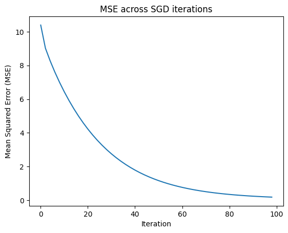
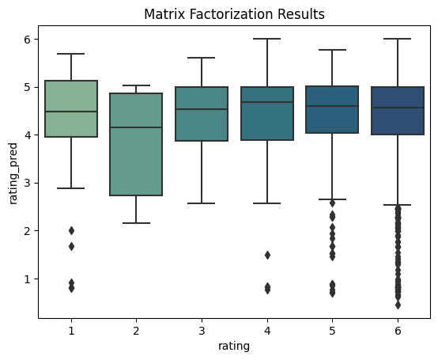
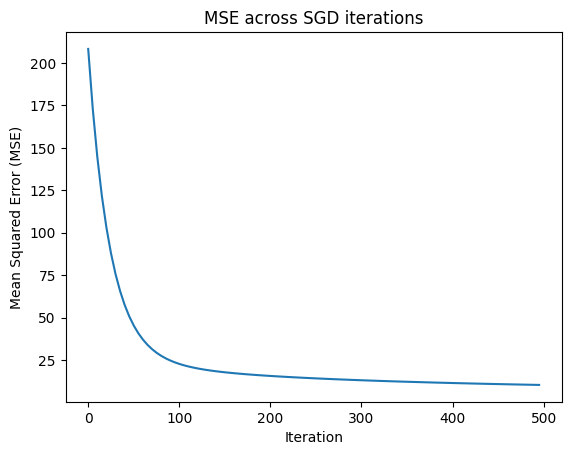
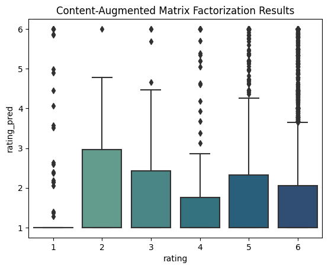

---
author:
- Micaela McCall
date: July 29 2023
title: |
  ISYE 6740 Summer 2023 Project Report

  "Augmented recipe recommendation using flavor profile, ingredients,
  and cooking technique"
---

# Background and Literature Review

As the amount of information on the internet has ballooned,
recommendation systems have become increasingly crucial to help users
find desired information without having to do extensive manual search.
The goal of a recommender system is to predict the rating a user would
give to a new item and to suggest to the user items for which the
predicted rating is high. Food and recipe recommendation is a domain in
which these systems are particularly relevant given the vast number of
online recipes. Recipe recommendation has gained traction in the
healthy-eating community as a way to suggest healthier meals or
ingredient substitutions \[1, 2, 3\]. It is also a relevant context for
group recommender system research; i.e., how to suggest recipes based on
the preferences of all members of a group \[4\].\
In addition to its many applications, basic recipe recommendation offers
fertile ground for researching the nuances of recommendation systems
because of the rich information about recipe contents (ingredients),
types of recipes (breakfast, dinner, desert, etc.), styles of cooking,
nutritional contents, etc. Some relevant questions in this area are: How
do we quantify a user's preference for specific ingredients given their
rating of a recipe and leverage this information to improve
recommendation? How do we incorporate preferences for particular types
of recipes? How do we build recommender systems under constraint, such
as only recommending recipes that conform to dietary restrictions?\
Researchers have tried to address some of these questions through
iteration on various approaches to algorithmic recommendation. Some of
the most common are:

**Collaborative filtering (CF)** is a method that uses the ratings of
many users over many items to identify similar users and predict the
rating a user would give to an item based on the ratings given by
similar users. The only data necessary for this approach is ratings
history on items \[5\].

**Content-based (CB)** is a method that uses information about items to
calculate similarity between new items and items a user has historically
rated to predict the rating a user would give to an item \[1\]. For
example, in the recipe/food domain, Freyne and Berkovsky (2010) broke
down ratings for a recipe into ratings for ingredients and then
reconstructed a prediction for a new recipe using a user's ratings for
the constituent ingredients.

**Knowledge-based (KB)** is a method that uses content knowledge about
the item as well as knowledge about users needs or a set of constraints
to recommend specific items and then includes an iterative process of
eliciting users' feedback. \[1, 7\]

**Hybrid approaches** are particularly used in recipe recommendation
because we have both plentiful user ratings data and about item content.
These approaches aim to combine the strengths of multiple previously
mentioned approaches. \[1, 7\]\
In my literature review, I noticed that many attempts to recommend
healthy foods used a KB approach; they didn't just reflect the user's
preferences, but also the nutritional needs of the particular user based
on their demographic information, e.g. in Alberg (2006). Attempts to
conform to dietary restrictions were treated similarly \[8\]. However, I
didn't find instances where rich recipe-based metadata was included in
recommender algorithms to try to improve the quality of the
recommendation, other than in Freyne and Berkovsky (2010).

# Problem Statement

The aim of this project is to explore and compare the performance of CB,
CF, and hybrid recommender algorithms in the context of recipe
recommendation, while leveraging recipe flavor profiles and recipe
metadata (meal type, cooking technique, cooking time) in the
recommendation.\
In contrast with some of the approaches mentioned above, I didn't search
for access to a data set where recipe ratings for individuals with rich
person-centered metadata was available. Rather, my goal is to use solely
recipe-related metadata, and enhance this with a second data source of
flavor profiles, directly in the implementations of CB, CF, and hybrid
recommender algorithms.\
Additionally, in the context of CB recommendations, I want to expand on
the approach used by Freyne and Berkovsky (2010) to include recipe
flavor and metadata.

# Data Sources

The first data set is a set of recipes from Food.com, made available on
as a Kaggle dataset
(<https://www.kaggle.com/datasets/shuyangli94/food-com-recipes-and-user-interactions?resource=download&select=RAW_recipes.csv>).
The recipes data ncludes the name of the recipe, a description of the
recipe, recipe tags, the nutritional value, the steps in make the
recipe, and the ingredients.\
The second data set is a set of recipe interactions also from Food.com
and also made available through Kaggle
(<https://www.kaggle.com/datasets/shuyangli94/food-com-recipes-and-user-interactions?resource=download&select=RAW_interactions.csv>).
This data set includes the rating and review given to a recipe by
various users (recipe id matches up to the recipe id in the recipes data
set above).\
The third data set provides the flavor molecules and associated flavor
profile for a given food (from
<https://cosylab.iiitd.edu.in/flavordb/>). It is accessed via API calls
for each ingredient in the recipes from the first datset.\
A final data set provides ingredient lemmatization, or in orther words
associating each possible ingredient with a \"base\" version of that
ingredient (e.g. all types of lettuce become \"lettuce\"). Also made
available through Kaggle
(<https://www.kaggle.com/datasets/shuyangli94/food-com-recipes-and-user-interactions/discussion/118716?resource=download&select=ingr_map.pkl>).

# Methodology

## Data gathering

A unified list of ingredients was collected for all recipes in the
following way: for each recipe, I applied a SpaCy model to a string
representation of its ingredients and only the noun and proper nouns
were preserved, and then all noun and proper nouns were given a unique
id and added to a de-duplicated list. The reason for this pre-processing
step is that each word in the list was queried in the FlavorDB API, and
it wouldn't do to query a modifier (e.g. "fresh\" in the ingredient
"fresh strawberries\").

For each ingredient in this list, I queried the FlavorDB search API to
find the most similar search result that exists in their DB. For the
search match, the search term was then used in the query for specific
flavor molecules, which were subsequently matched with their individual
flavors. This resulted in many flavors for each particular ingredient as
per this example.

{#fig:lettuce_word_cloud width="50%"}

## Data Preprocessing

Each recipe id was merged with its constituent ingredients and each
ingredient's' corresponding flavors. In addition, the data set was
downloaded with a set of technique ids associated with each recipe.
After tracking down the corresponding techniques in the following source
code for the data set, I was able to match each technique to each recipe
that used it. At this point, each recipe "detail\" was collated and
given a detail id (ingredients, flavors, and techniques).

These data were merged with the user interactions data such that the
rating for each recipe could also be associated with each detail of that
recipe. For example, when averaging the rating across all the recipes
that has a particular ingredient, you would get the average rating for
that ingredient across the whole data set.

{#fig:flavs120 width="80%"}

{#fig:flavors_mentions width="60%"}

{#fig:ratings_dist width="90%"}

## Train-test split

I created my training and testing sets in an intentional way because I
wanted to make sure that I could generate ratings for as many
user-recipe pairs as possible. Namely, for each recipe where there was
at least 10 ratings, I randomly selected one user-rating for that recipe
to be part of the test set. This guaranteed that I wouldn't run into the
issue when testing that data that a recipe in the test set does not
exist at all in the training set. Now, it's still possible that there
could not exist a rating for a recipe among the closest neighbors of a
particular user, so this doesn't entirely fix the possibility that I may
not be able to generate predictions for some user-recipe pairs.

## Recommendation Algorithms

Each of the following algorithms was applied on the recipe interactions
data.\
**Baseline model**

First, built a model that randomly predicts ratings for a given user on
a given recipe by sampling from a uniform distribution.\
**Collaborative filtering (CF)**

**Nearest neighbors:** calculate the nearest neighbors of a new user
measured by cosine similarity:
$$Sim(u_i, u_k) := \frac{r_i * r_k}{||r_i||*||r_k||} = \frac{\sum_{j=1}^mr_{ij}r_{kj}}{\sqrt{\sum_{j=1}^mr_{ij}^2\sum_{j=1}^mr_{kj}^2}}$$
where $r_i$ and $r_k$ are ratings vectors for users $u_i$ and $u_k$.

Predict a user's rating on a new recipe $r_{ij}$ by weighted average
with bias avoided by by subtracting each user's average rating
$\tilde{r_k}$ from their rating of the recipe and adding in the target
user's average rating $\tilde{r_i}$:
$$r_{ij} = \tilde{r_i}+\frac{\sum_kSim(u_i, u_k)(r_{kj}-\tilde{r}_k)}{\text{num ratings}}$$

**Matrix Factorization:** aims to decompose the user's preferences for
into preferences for a set of latent factors. Matrix factorization can
be performed using Singular Value Decomposition (SVD):
$$M = U\Sigma V^T$$ 
By selecting the top $k$ singular values of matrix
$\Sigma$, we can reconstruct matrix $M$ with less dimensions but still
capturing much of the variability of the original matrix \[9\]. The
concept here, when applied over recipe ratings, would be to find the
dimensions of latent food preferences so as to avoid having to deal with
the high dimensionality of individual recipe ratings.

However, when factoring a sparse matrix, it's more efficient to use
Non-negative Matrix Factorization (NMF), which involves finding $P$ and
$Q$ such that the reconstructed user-item rating
$\hat{r}_{ui}= q_i^Tp_u$ is as close as possible to the true ${r}_{ui}$.
In order to find $P$ and $Q$, the Mean Squared Error is minimized:

$$min_{q,p} \sum_{(u, i) \in TR} (r_{ui} - q_i^Tp_u)^2 + \lambda(||q_i||^2+||p_u||^2)$$
where $p_u$ is the user vector, the $u$-th row of matrix $P$, and $q_i$
is the item vector, the $i$-th row of matrix $Q$, and $TR$ is the
training set \[9\]. I implemented this optimization by hand by
performing Gradient Decent according to the implementation in Luo et al.
(2014). On each update of the Gradient Decent, the entries of the $P$
and $Q$ matrices are updated as below:

$$p_{u,k} \leftarrow p_{u,k}\frac{\sum_{i \in TR}q_{k,i} r_{u,i}}{|I_u|\lambda p_{u,k} + \sum_{i \in TR} \hat r_{u,i}}$$

$$q_{k,i} \leftarrow q_{k,i}\frac{\sum_{i \in TR}p_{u,k} r_{u,i}}{|U_i|\lambda q_{k,i} + \sum_{i \in TR} \hat r_{u,i}}$$
where $I_u$ is the number of ratings for that user in the item set, and
$U_i$ is the number of rating for that item in the user set. A
prediction for a new user-recipe pair is simply the $\hat r_{ui}$ entry
in the reconstructed $\hat R = PQ^T$ matrix.\
**Content-based (CB)**

A rating for each user on each ingredient is calculated as the average
of the ratings each user gave to all recipes including that ingredient:
$$rat(u_i, ingr_j) = \frac{\sum_{l; ingr_j \in l}r_{il}}{l}$$ 
where
$r_{il}$ is the rating user $i$ gave to recipe $l$. This formula is then
applied over the flavor profile of each recipe, tags, and cooking
techniques, to create a comprehensive recipe-based data source for each
user. Predict a user's rating on a new recipe $r_{ij}$ by finding the
average rating across all the ingredients, flavors, and cooking
techniques in the new recipe:

$$r_{ij} = \frac{\sum_{l\in rec_j} rat(u_i, ingr_l)}{l}$$

**Hybrid**

**Content-augmented CF using cosine similarity**: attempts to generate
as many ratings as possible for a user on ingredients, flavors, and
techniques using ratings given by similar users, and then uses an
average of the ratings of the content of a recipe to predict a new
user-recipe rating.\
To be more specific, this involved three steps:

**1.** I used Equation 1 to find the nearest neighbors of a new user (as
in the CF approach).

**2.** Then, I used the following equation to predict a new user's
ratings on ingredients, flavors, and techniques that they hadn't already
rated:

$$rat(u_i, ingr_d) = \frac{\sum_k Sim(u_i, u_k)rat(u_k, ingr_d)}{\text{num ratings of }d}$$

**3.** Then I used Equation 8 to predict a user's rating on a new recipe
$r_{ij}$.

**Content-augmented matrix factorization**: takes the matrix
factorization approach to CF and augments the item data with content. I
used NMF for this approach, like the basic matrix factorization
approach. However, I incorporated recipe content information into this
factorization by further factoring the matrix $Q$ (shape: num features
by num recipes) as $X\Phi$, where $X$ is a matrix (shape: num recipes by
num ingredients) in which $X_{id}$ is a binary indicator if ingredient
$d$ is in recipe $i$. This results in the following NMF factorization of
matrix $R$: $$R = P\Phi^TX^T$$ My source for this approach is Forbes et
al. (2011). This updated NMF results in the following minimization of
MSE: $$min_{\phi,p} \sum_{(u,i) \in TR} (r_{ui} - p_u\Phi^Tx_i^T)^2$$

Rather than implementing the updates to each matrix on each iteration of
Gradient Descent by hand like I did for the basic matrix factorization,
I decided to use Pytorch to calculate and update the matrices according
to MSE loss. Once training is complete, a prediction for a new
user-recipe pair is simply the $\hat r_{ui}$ entry in the reconstructed
$\hat R = P\Phi^TX^T$ matrix.

# Evaluation and Final Results

I trained each model above using the training set described previously,
and then generated predictions using each user-recipe pair in the
testing set. I used Root Mean Square Error (RMSE), Mean Absolute Error
(MAE) and coverage (ability to generate predictions) \[6\] to evaluate
the performance of each approach.
|  Model                                  |  RMSE  |   MAE   |    Coverage |
|  ---------------------------------------| -------| --------| ----------|
|  Baseline                               |  2.5185|   2.04112|   1.0|
|  Vanilla CF                             |  0.9805|   0.5617|    1.0|
|  Matrix factorization CF                |  1.7859|   1.4959|    0.6837|
|  CB                                     |  1.3987|   1.0338|    0.3343|
|  Content-augmented CF                   |  1.0787|   0.8480|    0.9995|
|  Content-augmented matrix factorization |  4.1741|   3.8136|    1.1|

Below are further details on the implementation and results of each
algorithm. I found that plotting the rating predictions across the true
ratings in the test set was a helpful way to see differences in trends
across different algorithms.

Because this data set is very skewed, specifically in that there are
many more ratings of 5 and 6 then 1, 2, and 3, this results in some
issues with the metrics mentioned above, namely that by predicting a
score of 6 across all ratings, you can actually get fairly good metrics.
We can see below that that is what happened with the several of the
models.

## Baseline model

As mentioned in section 4.4, these predictions were selected from a
uniform random distribution betwen 1 and 6.

{#BL width="60%"}

## Vanilla CF model

For this model, I compared results for the most similar 10 users, most
similar 50 users, and most similar 100 users.

Below are the predictions results of averaging the ratings of the most
similar 50 users for each user-recipe pair in the test set.

{#fig:CF width="60%"}

## Matrix Factorization CF

I chose to perform the factorization into 40 latent factors because this
number is a common default for recommendation packages in python. I
decided to go with this approach rather choosing this number through
cross-validation because I wanted to focus my time for this project more
on exploring different algorithms rather than tuning this particular
approach. I initialized the $P$ and $Q$ matrices as uniform random
matrices between 0 and 1. The shapes of these matrices are:

-   $P$: number of users by number of features (40).

-   $Q$: number of features (40) by number of recipes.

I trained the model by performing Gradient Descent for 100 iterations
according to the matrix updates in section 4.4. Below is the training
loss across iterations and the distribution of testing predictions
versus true ratings.

<figure id="fig:CF">

 

<figcaption>Left: MSE plotted across iterations, which shows the
algorithm converging; Right: Distribution of predicted ratings across
true ratings for Matrix Factorization Algorithm</figcaption>
</figure>

## CB model

This model had the lowest coverage ratio of about 33%. This means that
this approach was able to generate predictions for only about one-third
of the user-recipe pairs in the test data. This is because in order to
generate a rating, the user must have rated another recipe that has at
least one of the ingredients in the new recipe, which is a tall order
for such a sparse data set. Overall, this approach did not perform as
well as the CF approach in multiple ways. We can see as well in the plot
below that there are similar issues of predicting mostly ratings between
5 and 6 across the whole data set.

{#fig:CB width="60%"}

## Content-augmented CF

For this approach, I used 50 most similar users as I did for the vanilla
CF.

Here, we again face the issue of there being very little variation in
the predictions across all the true ratings. Unfortunately it appears
that the main effect of including recipe-content information in the CF
approach had the effect of bringing down the average rating by about 0.5
without doing much else. My guess as to why this is happening is that in
this sparse data set, most users may have only rated a couple of recipes
and therefore very little in that user across recipes. Extending the
rating of this recipe to it's content data would not actually give a
more varied look at the user's preferences, and might have teh effect of
diluting the variation in the data set more by increasing the number of
observations with the same associated rating.

{#fig:ratings_dist width="60%"}

## Content-augmented Matrix Factorization

I started this process by creating the recipe-content matrix $X$, which
is described in section 4.4. As with previous factorization approach, I
chose to use 40 latent factors. I performed the optimization for this
problem via Pytorch. I initiated the matrices $P$ and $\Phi$ as random
uniform distributions betwen 0 and 1. The three matrices had the
following shapes:

-   $P$: number of users by number of features (40).

-   $\Phi$: number of features (40) by number of recipe contents.

-   $X$: number of recipe contents by number of recipes.

I used Pytorch's typical workflow to calculate MSE loss and update the
$P$ and $\Phi$ matrices via Gradient Descent on each training iteration.
I trained for 500 iterations. Below is the training loss across
iterations and the distribution of testing predictions versus true
ratings.

<figure id="fig:CF">

 

<figcaption>Left: MSE plotted across iterations, which shows the
algorithm converging; Right: Distribution of predicted ratings across
true ratings for Matrix Factorization Algorithm</figcaption>
</figure>

## Summary, Future Directions

In conclusion, I did not find that including content-related recipe such
as ingredients, flavors, and cooking techniques universally improved the
quality of user-recipe pair rating predictions. Overall, the best
performance was actually found from vanilla CF, despite the fact that
matrix factorization is commonly considered to be the most performant CF
approach. I imagine that if I had the computational resources to train a
matrix factorization model for longer and perform a complete
hyperparameter tuning, I would get better results for that model.
Compared to pure CB, CF approach did result in more accurate
predictions, and combining content with vanilla CF improved the metrics
in comparison with pure CB.

For future experimentation, I would want to investigate the extent of
overlap of recipe content (ingredients, etc.) across recipes. It's
possible that if there is a large amount of overlap, the result of
including more content data is actually diluting the personalized
information in the data set. An additional avenue for experimentation is
the distribution of ratings in the training data. While I'm sure that
this skewed distribution had some effect on the performance of these
algorithms, re-sampling the data so that the ratings were normally or
uniformly distributed would result in a data set that is not
representative of real-world rating systems where these algorithms would
be implemented. When it comes to including content-based information in
CF recommendation algorithms, the challenge is include enough
information to augment, but not too much to decrease the variation
across items or users. Therefore, in the future I would want to try a
tuning paradigm where different amounts of content information is
included and the quality of predictions as well as parameters of the
training data distribution are compared.

# References

1.  Trang Tran, T. N., Atas, M., Felfernig, A., & Stettinger, M. (2018).
    An overview of recommender systems in the healthy food domain.
    *Journal of Intelligent Information Systems*, 50 (pp. 501-526).

2.  Pecune, F., Callebert, L., & Marsella, S. (2020, September). A
    Recommender System for Healthy and Personalized Recipes
    Recommendations. In *HealthRecSys@ RecSys* (pp. 15-20).

3.  Van Pinxteren, Y., Geleijnse, G., & Kamsteeg, P. (2011, February).
    Deriving a recipe similarity measure for recommending healthful
    meals. In *Proceedings of the 16th international conference on
    Intelligent user interfaces* (pp. 105-114).

4.  Masthoff, J. (2011). Group recommender systems: Combining individual
    models. *Recommender systems handbook*, Springer (pp. 677--702).

5.  Ajitsaria, A. Build a Recommendation Enging with Collaborate
    Filtering. *RealPython.com*

6.  Freyne, J., & Berkovsky, S. (2010, February). Intelligent food
    planning: personalized recipe recommendation. In *Proceedings of the
    15th international conference on Intelligent user interfaces* (pp.
    321-324).

7.  Burke, R. (2002). Hybrid Recommender Systems: Survey and
    Experiments. *User Model User-Adap Inter* 12, (pp. 331--370).

8.  Aberg, J. (2006, January). Dealing with Malnutrition: A Meal
    Planning System for Elderly. In *AAAI spring symposium:
    argumentation for consumers of healthcare* (pp. 1-7).

9.  Luo, S. (2018, December). Introduction to Recommender System
    Approaches of Collaborative Filtering: Nearest Neighborhood and
    Matrix Factorization. *towardsdatascience.com*

10. Forbes, P., & Zhu, M. (2011, October). Content-boosted matrix
    factorization for recommender systems: experiments with recipe
    recommendation. In *Proceedings of the fifth ACM conference on
    Recommender systems* (pp. 261-264).

11. X. Luo, M. Zhou, Y. Xia and Q. Zhu. (May 2014). An Efficient
    Non-Negative Matrix-Factorization-Based Approach to Collaborative
    Filtering for Recommender Systems,\" in *IEEE Transactions on
    Industrial Informatics,* vol. 10, no. 2 (pp. 1273-1284)
